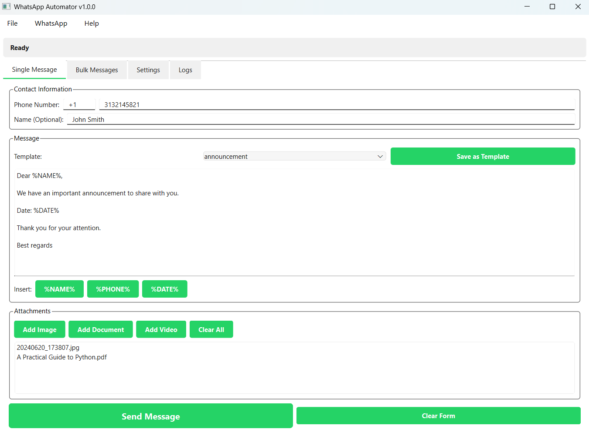

# WhatsApp Automator

Comprehensive automation solutions for WhatsApp messaging across multiple platforms. This repository contains two distinct implementations for automating WhatsApp - one for the web version and one for the desktop application.

## 📦 Available Versions

### 🌐 Web Version (`/Web`)
A modern PyQt6 application that automates WhatsApp Web through browser automation.

**Key Features:**
- Cross-platform support (Windows, macOS, Linux)
- Single and bulk messaging capabilities
- Advanced contact management with CSV/Excel import
- Message templates with dynamic placeholders
- Media attachments (images, documents, videos)
- Real-time progress tracking
- Session persistence

**Technologies:** Python, PyQt6, Selenium, Chrome WebDriver

[Full Documentation →](Web/README.md)

### 🖥️ Desktop Version (`/Desktop`)
A Windows-native application that automates WhatsApp Desktop using UI automation.

**Key Features:**
- Native Windows integration
- Excel-based contact management
- Multi-line message support
- Image attachments
- Auto-detection of WhatsApp installation
- Real-time logging

**Technologies:** C#, .NET Framework, Windows Application Driver, Selenium

[Full Documentation →](Desktop/README.md)

## 🚀 Quick Start

### Web Version
```bash
cd Web
pip install -r requirements.txt
python app.py
```

### Desktop Version
1. Install Windows Application Driver
2. Enable Windows Developer Mode
3. Run `WhatsAppAutomator.exe` from the Desktop folder

## 🔧 Requirements

### Web Version
- Python 3.8+
- Google Chrome
- Active WhatsApp account

### Desktop Version
- Windows 10/11
- WhatsApp Desktop app
- .NET Framework 4.7.2+
- Windows Application Driver

## 📊 Comparison

| Feature | Web Version | Desktop Version |
|---------|------------|-----------------|
| **Platform** | Cross-platform | Windows only |
| **WhatsApp Type** | WhatsApp Web | WhatsApp Desktop |
| **Programming Language** | Python | C# |
| **UI Framework** | PyQt6 | Windows Forms |
| **Contact Import** | CSV, Excel | Excel |
| **Message Templates** | ✅ Advanced | ✅ Basic |
| **Media Support** | Images, Docs, Videos | Images |
| **Bulk Messaging** | ✅ | ✅ |
| **Session Persistence** | ✅ | ✅ |
| **Contact Groups** | ✅ | ❌ |
| **Message Placeholders** | ✅ Multiple | ❌ |
| **Logs Export** | ✅ | ❌ |

## 📸 Screenshots

### Web Version


### Desktop Version
Available in the Desktop folder after running the application.

## ⚠️ Important Notes

- **Compliance**: Use these tools in accordance with WhatsApp's Terms of Service
- **Responsibility**: Avoid sending spam or unsolicited messages
- **Rate Limiting**: Implement reasonable delays between messages
- **Consent**: Always obtain consent before sending automated messages

## 🤝 Contributing

Contributions are welcome! Please feel free to submit a Pull Request. For major changes, please open an issue first to discuss what you would like to change.

## 📄 License

This project is licensed under the MIT License - see the LICENSE file for details.

## 🚨 Disclaimer

These tools are not affiliated with WhatsApp or Meta. They are independent automation solutions that interact with the official WhatsApp applications. Use at your own risk and responsibility. The developers are not responsible for any account restrictions or bans that may occur from using these tools.

## 📞 Support

For issues, questions, or feature requests, please open an issue on GitHub.

---

**Choose the version that best fits your needs:**
- **Web Version**: Best for cross-platform use and advanced features
- **Desktop Version**: Best for Windows users who prefer native desktop integration