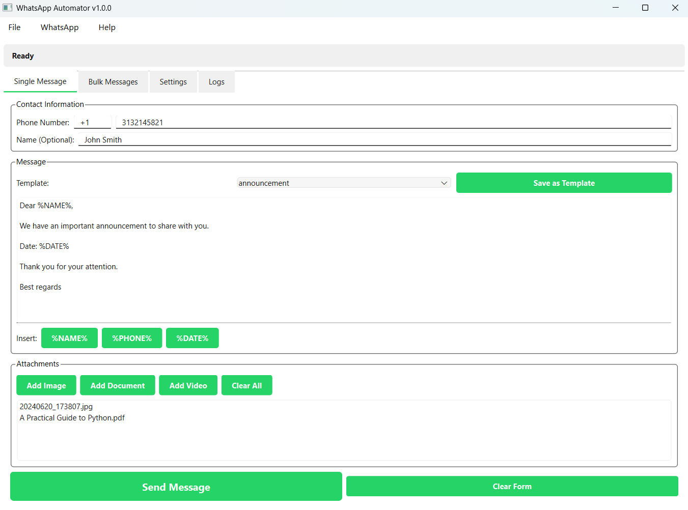
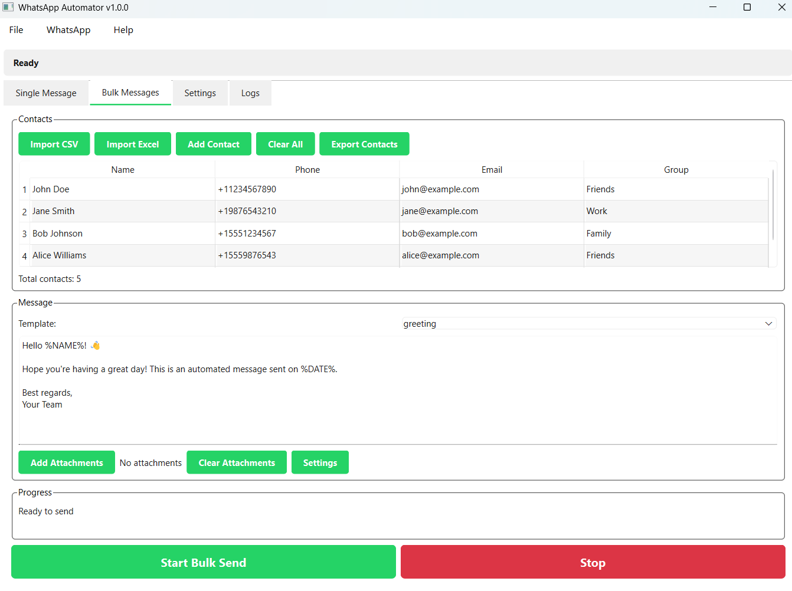

# WhatsApp Automator

A professional desktop application for automating WhatsApp Web messaging built with PyQt6 and Selenium.



## Features

- **Single Message Sending**: Send personalized messages to individual contacts
- **Bulk Messaging**: Send messages to multiple contacts from CSV/Excel files
- **Message Templates**: Save and reuse message templates with placeholders
- **Attachments Support**: Send images, documents, and videos
- **Session Persistence**: Stay logged in between sessions
- **Contact Management**: Import, export, and manage contacts
- **Real-time Logs**: Monitor all activities with detailed logging
- **Customizable Settings**: Configure delays, timeouts, and browser behavior

## Installation

1. Clone the repository:
```bash
git clone https://github.com/yourusername/whatsapp-automator.git
cd whatsapp-automator
```

2. Install dependencies:
```bash
pip install -r requirements.txt
```

3. Run the application:
```bash
python app.py
```

## Usage

### First Time Setup

1. Launch the application
2. Click "Login" to open WhatsApp Web
3. Scan the QR code with your phone
4. The session will be saved for future use

### Sending Single Messages

1. Go to the "Single Message" tab
2. Enter the recipient's phone number
3. Optionally add their name for personalization
4. Type your message (use placeholders like %NAME%, %PHONE%, %DATE%)
5. Add attachments if needed
6. Click "Send Message"

### Bulk Messaging



1. Go to the "Bulk Messages" tab
2. Import contacts from CSV or Excel file
3. Create or select a message template
4. Configure sending delay (to avoid rate limiting)
5. Click "Start Bulk Send"

### Contact File Format

CSV format:
```csv
name,phone,email,group
John Doe,+11234567890,john@example.com,Friends
Jane Smith,+19876543210,jane@example.com,Work
```

## Message Placeholders

- `%NAME%` - Contact's name
- `%PHONE%` - Contact's phone number
- `%DATE%` - Current date

## Settings

- **Default Country Code**: Automatically prepend to phone numbers
- **Message Delay**: Time between messages in bulk sending
- **Browser Settings**: Configure headless mode, session persistence
- **Notifications**: Enable/disable success and error notifications

## Project Structure

```
whatsapp-automator/
├── app.py                  # Main application entry point
├── config.py              # Configuration constants
├── requirements.txt       # Python dependencies
├── models/               # Data models
│   ├── contact.py
│   └── message.py
├── services/            # Business logic
│   └── whatsapp_service.py
├── ui/                  # User interface
│   ├── main_window.py
│   └── tabs/
│       ├── single_message_tab.py
│       ├── bulk_message_tab.py
│       ├── settings_tab.py
│       └── logs_tab.py
├── utils/              # Utility functions
│   └── file_handler.py
└── data/              # Data files
    ├── templates/     # Message templates
    └── contacts_example.csv
```

## Important Notes

- WhatsApp Web must remain open during message sending
- Respect WhatsApp's terms of service and rate limits
- Test with small batches before sending bulk messages
- The browser window will open automatically when sending messages

## Requirements

- Python 3.8+
- Chrome browser
- Active WhatsApp account

## License

MIT License

## Disclaimer

This tool is for educational purposes. Use responsibly and in accordance with WhatsApp's terms of service.